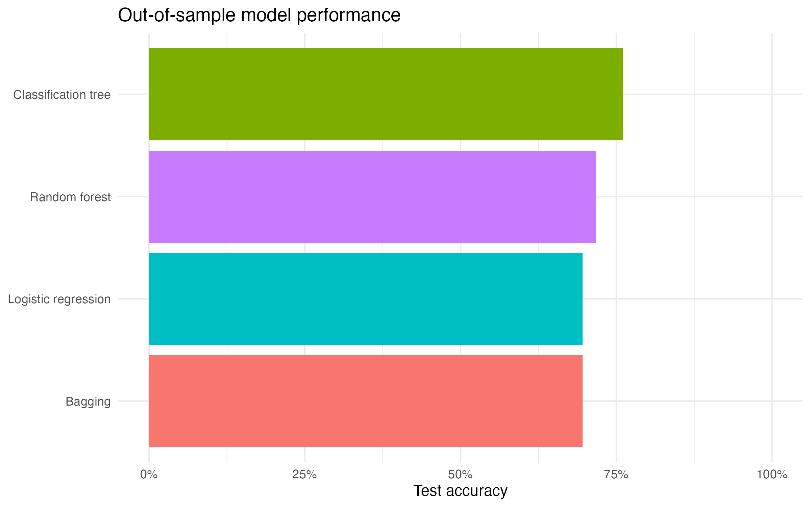

# Survival Classification in Critically Ill Patients

This project examines whether routinely collected physiological measurements can distinguish patients who survived from those who died. It modernizes a statistical analysis originally completed in 2020 by organizing the code into a reproducible R workflow, correcting the raw-data import, and preventing patient-level leakage during model evaluation.

> **Important:** This is an educational portfolio project, not a validated clinical decision-support tool. Its results must not be used to guide patient care.

## Research questions

1. Which demographic and physiological variables are associated with patient survival?
2. How accurately can logistic regression and tree-based classifiers distinguish survival outcomes?
3. Which predictors contribute most strongly to the fitted models?
4. How do an interpretable statistical model and more flexible machine-learning models compare on held-out patients?

## Data

The dataset contains **224 observations from 112 critically ill patients**. Each patient has two records:

- `Initial`: measurements recorded on admission.
- `Final`: measurements recorded shortly before discharge or death.

The outcome, `SURVIVE`, has two classes: `Survived` and `Died`. The raw CSV intentionally has no header row; column names are assigned during import. The original 2020 analysis read the first observation as a header and therefore retained only 223 records. The revised workflow imports and validates all 224 records.

### Data dictionary

| Variable | Type | Description |
|---|---|---|
| `ID` | Identifier | Patient identifier; connects the initial and final records for one patient |
| `AGE` | Numeric | Patient age in years |
| `HT` | Numeric | Patient height in centimeters |
| `Sex` | Categorical | Male or Female |
| `SURVIVE` | Binary outcome | Survived or Died |
| `SHOCK_TYP` | Categorical | Non-shock, hypovolemic, cardiogenic, bacterial, neurogenic, or other shock type |
| `SBP` | Numeric | Systolic blood pressure |
| `MAP` | Numeric | Mean arterial pressure |
| `HR` | Numeric | Heart rate |
| `DBP` | Numeric | Diastolic blood pressure |
| `MCVP` | Numeric | Mean central venous pressure |
| `BSI` | Numeric | Body surface index |
| `CI` | Numeric | Cardiac index |
| `AT` | Numeric | Appearance time |
| `MCT` | Numeric | Mean circulation time |
| `UO` | Numeric | Urinary output |
| `PVI` | Numeric | Plasma volume index |
| `RCI` | Numeric | Red cell index |
| `HG` | Numeric | Hemoglobin measurement |
| `HCT` | Numeric | Hematocrit measurement |
| `RECORD` | Categorical | Measurement occasion: Initial or Final |

Measurement units beyond those explicitly documented in the original report should be confirmed from the source data documentation before clinical interpretation.

## Methodology

The analysis proceeds in five stages:

1. **Import and validation**
   - Assign the 21 expected column names to the headerless CSV.
   - Verify the column count, category codes, and missing values.
   - Convert outcome and categorical predictors to labeled factors.
2. **Exploratory analysis**
   - Produce grouped descriptive statistics and box plots.
   - Examine correlations among quantitative predictors.
3. **Statistical modeling**
   - Fit separate univariate logistic regressions for candidate predictors.
   - Fit a multivariable logistic regression using `SBP`, `MCVP`, `UO`, `HG`, `SHOCK_TYP`, and the `SBP:UO` interaction retained from the original methodology.
   - Report estimated odds ratios and confidence intervals.
4. **Machine-learning models**
   - Fit a classification tree pruned with the one-standard-error rule.
   - Fit bagging and random-forest classifiers using 1,500 trees.
5. **Evaluation**
   - Compare accuracy, misclassification rate, sensitivity, and specificity on held-out patients.
   - Save confusion matrices and model summaries as reproducible output files.

## Leakage-safe validation

Because each patient contributes an initial and a final observation, randomly splitting individual rows could place one patient's initial record in training and the same patient's final record in testing. That would expose the models to information about a test patient during training and could overstate performance.

The revised analysis therefore:

- Samples unique patient IDs using a fixed seed (`set.seed(4)`).
- Assigns every record for a patient to the same partition.
- Uses 89 patients (178 records) for training and 23 patients (46 records) for testing.
- Applies the identical split to all four models for a fair comparison.
- Excludes `ID` from the predictor set.

This design is more defensible than the row-level split used in the original report, although repeated grouped resampling would provide a more stable performance estimate than one holdout split.

## Findings

Performance on the patient-level held-out test set was:

| Model | Accuracy | Sensitivity | Specificity |
|---|---:|---:|---:|
| Classification tree | 76.1% | 54.5% | 95.8% |
| Random forest | 71.7% | 63.6% | 79.2% |
| Logistic regression | 69.6% | 50.0% | 87.5% |
| Bagging | 69.6% | 54.5% | 83.3% |

In this particular split, the classification tree achieved the highest accuracy and specificity, while the random forest achieved the highest sensitivity for identifying patients who died. The ranking differs from the 2020 report, which favored bagging, because the revised analysis restores the omitted first observation and evaluates models on completely unseen patients.



The sample is small, so these values should be treated as estimates from one split rather than definitive evidence that one model is superior.

## Repository structure

```text
survival-classification/
├── data/
│   ├── raw/                         # Original source data
│   └── processed/                   # Validated, labeled analysis data
├── R/
│   ├── 00_setup.R                   # Dependencies, folders, helper functions
│   ├── 01_import_preprocess.R       # Import, validation, factor conversion
│   ├── 02_exploratory_analysis.R    # Summaries, plots, correlations
│   ├── 03_logistic_regression.R     # Split, univariate and final logistic models
│   ├── 04_classification_tree.R     # Tree fitting, pruning, evaluation
│   ├── 05_ensemble_models.R         # Bagging and random forest
│   ├── 06_model_evaluation.R        # Model comparison and performance plot
│   └── run_analysis.R               # Complete execution pipeline
├── figures/                         # Generated visualizations
├── results/                         # Generated tables and metrics
├── report/                          # Project report materials
├── README.md
└── survival-classification.Rproj
```

## Reproducing the analysis

### Requirements

- A current version of R
- RStudio is optional but recommended
- The following R packages:

```r
install.packages(c(
  "broom",
  "corrplot",
  "dplyr",
  "ggplot2",
  "ipred",
  "purrr",
  "randomForest",
  "readr",
  "rpart",
  "scales",
  "tibble",
  "tidyr"
))
```

### Instructions

1. Clone the repository.
2. Open `survival-classification.Rproj`, or set the repository root as the working directory.
3. Confirm that the source file exists at `data/raw/DATA-FILEsp2020.csv`.
4. Run the complete workflow:

```r
source("R/run_analysis.R")
```

The pipeline recreates `data/processed/processed_data.csv` and writes analysis artifacts to `figures/` and `results/`. It stops with an informative message if required packages or source data are missing.

For exact package-version reproducibility, a future improvement is to initialize [`renv`](https://rstudio.github.io/renv/) and commit its lockfile.

## Limitations

- **Small sample:** The dataset contains only 112 patients, limiting precision and model complexity.
- **Single holdout split:** Results may vary with a different patient partition. Grouped repeated cross-validation or bootstrap validation is preferable.
- **Temporal leakage risk:** Final measurements occur shortly before discharge or death and may contain information unavailable when an early clinical prediction would be required. A deployment-oriented model should be trained and evaluated using admission-time information only.
- **No external validation:** Performance has not been tested on patients from another hospital, region, or time period.
- **Historical data and limited provenance:** The age, collection protocol, population characteristics, and complete measurement units require further documentation.
- **Feature-selection uncertainty:** Univariate significance and correlation-based screening can be unstable in small samples and do not guarantee optimal predictive performance.
- **Class-specific performance:** Sensitivity for patients who died remains modest across models; accuracy alone is not sufficient for a clinically consequential task.
- **No causal interpretation:** Associations and variable importance do not establish that a predictor causes survival or death.

## Next steps

- Restrict prediction to initial/admission measurements and define a precise prediction time.
- Use repeated grouped cross-validation by patient.
- Add ROC-AUC, precision-recall, calibration, and uncertainty estimates.
- Compare penalized logistic regression with the current models.
- Create a Quarto report that distinguishes the original 2020 analysis from the corrected workflow.
- Add an `renv.lock` file and fuller dataset provenance documentation.

## Author

Navid Hedayati
